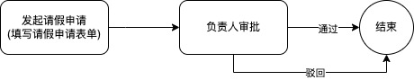

# 工作流 workflow

工作流是对一系列操作步骤的整合.

我们以请假来举例:

以上的流程中有几个重要的内容: 表单, 负责人, 审批动作.
该流程中使用了一个表单, 在发起时填写, 在审批时需要查看表单内容, 审批需要指定负责人, 审批通过和驳回都立即结束.

这里关键的一点是: 在流程发起之后流转到负责人那边需要将数据主键给到流程实例, 这样负责人才能看到填写的请假信息, 这正是工作流引擎所负责的内容.

## 流程引擎

以下是常用的开源流程引擎

- Activiti
- Flowable
- Camunda

[这里](https://blog.csdn.net/qq_30739519/article/details/86682931)是对三个引擎的对比

相比而言国内使用 Flowable 和 Camunda 的比较多.

Camunda 的[中文文档](http://camunda-cn.shaochenfeng.com/)

## BPMN2.0

BPMN 全称, 业务流程模型注解 Business Process Modeling Notation. 实际上就是用来描述流程各个节点和分支的一系列图形(Shape)的**标准**, 注意是一套标准而不是具体的实现.
一个拥有从开始到结束完整流程的图形集合被称作**流程模型**. 设计流程模型的过程被叫做**建模**. 每个模型由开始节点用户发起, 发起后立即产生一个**流程实例**, 流程结束之前流程实例都属于激活状态.

### 开始事件和结束事件 Start Event and End Event <Badge text="重要" />

开始事件和结束事件分别表示流程的开始与结束, 用一个圆形表示. 通常一个流程只包含一个开始时间.

开始事件又分为三种: 空开始事件, 定时开始事件, 消息启动事件.

空开始事件顾名思义他无需任何外接触发方式来触发, 由该事件上指定的发起人发起

### 结束事件 Enn Event <Badge text="重要" />

表示流程或分支的自然结束，什么都不做。流程所有的结束事件都到达后, 整个流程实例被标记为结束或者完成.

### 边界事件 Boundary Event

边界事件属于中间事件的一类。边界事件附加在活动（任务）的边界上，此时的事件只能捕获触发器。根据捕获后对路线影响的不同行为，又分为两种：边界中断事件和边界非中断事件。

### 中间事件 Intermediate Event

在开始事件和结束事件之间发生的事件都称为中间事件。中间事件会影响流程的流转路线，但不会启动或直接终止流程的执行。

| 中间事件     | 描述 |
| ------------ | ---- |
| 捕获时间事件 |      |
| 捕获信号事件 |      |
| 捕获消息事件 |      |

### 顺序流 Sequence Flow <Badge text="重要" />

顺序流是流程中两个元素间的连接器。在流程执行过程中，一个元素被访问后，会沿着其所有出口顺序流继续执行。
这意味着 BPMN 2.0 的默认是并行执行的, 两个出口顺序流就会创建两个独立的、并行的执行路径。
顺序流上可以添加流转条件(如果顺序流从排他网关或包容网关或复杂网关上流转出来).

### 任务 Task <Badge text="重要" />

任务是业务流程中的最基本单元, 一个工作流就是由各个任务组成, 任务被分为以下几种:

| 任务                  | 描述                                                                                           |
| --------------------- | ---------------------------------------------------------------------------------------------- |
| 用户任务 User Task    | 任务的执行需要指定用户或用户组(部门,单位,角色, 职位等等)                                       |
| 服务任务 Service Task | 可以用于调外部服务或自动执行程序。                                                             |
| 发送任务 Send Task    | 发送任务是一个简单的任务，旨在向外部参与者发送消息（相对于该过程）。发送消息后，任务就完成了。 |
| 接收任务 Receive Task | 等待外部流程参与者发送消息的任务。                                                             |
| 脚本任务 Script Task  | 用于执行定义好的脚本程序，流程执行到这个结点自动执行脚本。                                     |

### 网关 Gateway <Badge text="重要" />

网关用来控制顺序流的交互. 网关被分为以下几种:

| 网关                       | 描述                                                                                                                                      |
| -------------------------- | ----------------------------------------------------------------------------------------------------------------------------------------- |
| 排他网关 Exclusive Gateway | 从该网关出去的流只有条件为 true 能够继续执行, 如果有多个则第一个为 true 的继续执行                                                        |
| 并行网关 Parallel Gateway  | 并行网关用于无条件的拆分或合并分支，该类网关对连线条件是忽略的。并行网关有分支和合并两种行为，允许多进多出。                              |
| 包容网关 Inclusive Gateway | 包容网关的所有条件为 true 的后继分支都会被依次执行，如果所有分支条件决策都为 false 且该网关定义了一个默认的连线，那么该默认分支将被执行。 |

:::tip
**排他拆分**: 顺序判断排他网关定义的每个分支连线的条件，但最多只有一个分支被执行。使用排他网关的分支连线必须设置条件规则，未设置规则的连线被评估为 false。由于排他网关所有流出的分支按顺序评估，确定判断的顺序是非常重要的。如果后继多个分支存在都不通过的情况，应该合理的选择一个默认路径，否则引擎执行到该网关的分支将被中断于此。

**排他合并**: 只要前置分支有一个到达，该网关的后继路径被激活。这意味着使用排他网关做合并时，应使用在一进一出的场景。如果前置可能会有多个正在执行的分支（如使用了并行网关或包容网关做路径拆分），排他网关之后的路径将在每个分支到达时被重复执行, 这就做不到排他了（除非这是你希望达成的预期结果，否则应避免这种情况的发生, 也就是说你合并的前置分支最好使用排他网关拆分的, 因为排他网关拆分的分支有且只有一条会执行）。
:::

:::tip
**并行拆分**: 并行网关的每个后继分支路径都被无条件执行。

**并行合并**: 所有到达并行网关的分支路径都汇聚于此等待，直到每个输入流的分支都执行完毕，然后执行该网关的输出流，如果其中有分支未被执行或中断，那么该并行网关将处于永久等待状态。
:::

:::tip
**总结**: 并行网关拆分如果需要合并用并行网关合并, 可以达到会签(多个人审批通过)的效果哦. 排他网关拆分用排他网关合并.
:::

### 子流程 Subprocess

### 监听器 Listener

## 审批动作名词解释

- 会签, 多个节点同时完成
- 加签, 流程实例上单独加一个或多个节点
- 补签, 补充说明
- 通知, 某个节点流入或流出时, 可由监听器发起
- 催办, 流程发起者可以催办来给当前处理人发起催办
- 撤回, 执行完成后立即撤回

## 对请假流程的拓展
基于文章首页的基础请假流程, 可以拓展出更多的流程模型.